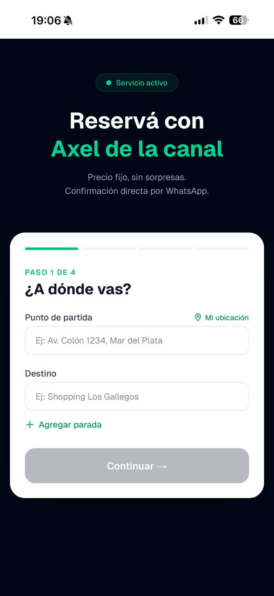
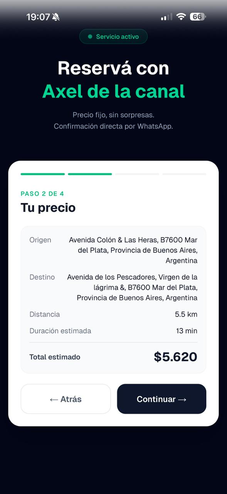
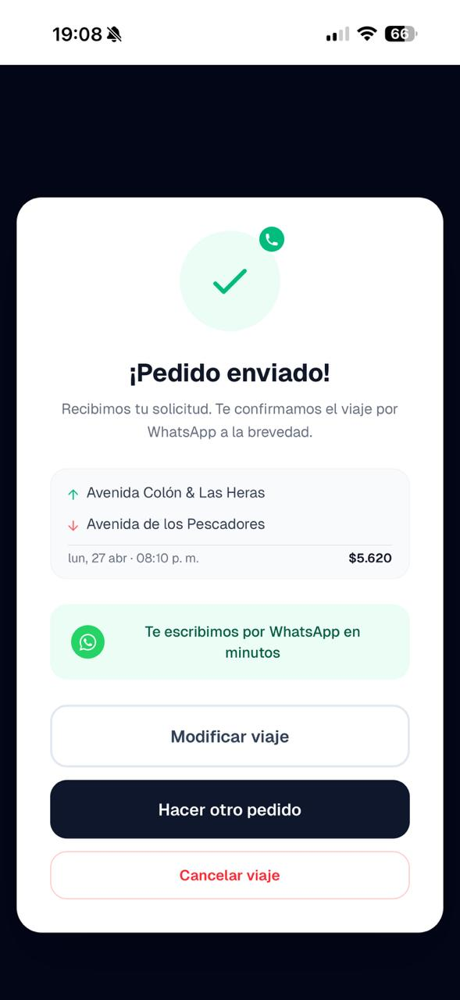
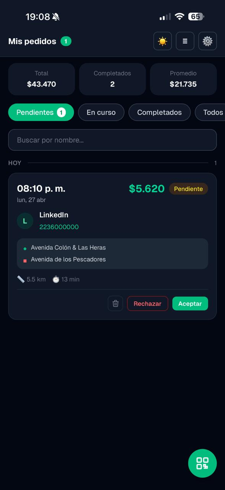

# app-para-pedirme

PWA en producción para gestionar pedidos de viajes recurrentes 
entre usuarios. Resuelve el caos de coordinar traslados habituales 
(familia, amigos, trabajo) sin perder el hilo en chats dispersos.

🔗 **Demo**: https://app-para-pedirme.vercel.app

---

## ¿Qué resuelve?

Cuando alguien te pide viajes seguido (un familiar, un amigo, un cliente), 
la información se pierde entre WhatsApp, Maps y memoria. Esta app 
centraliza todo:

- El usuario que solicita pide el viaje desde la app
- El conductor recibe notificación push instantánea
- Ambos ven la ruta y tiempos en vivo
- Histórico persistido para reincidencias frecuentes

## Screenshots

<div align="center">
  
  
  
  
</div>

## Stack técnico

- **Frontend**: Next.js 15 (App Router) + TypeScript + Tailwind CSS
- **Backend**: API Routes de Next.js + Supabase (PostgreSQL + Auth + Realtime)
- **Mapas**: Google Maps API (rutas, geocoding, distancia)
- **Notificaciones**: Web Push con VAPID (sin Firebase)
- **Sincronización en vivo**: Supabase Realtime (websockets)
- **PWA**: Service Worker + Manifest + offline-first
- **Deploy**: Vercel + Supabase Cloud

## Decisiones técnicas destacables

### Web Push con VAPID directo (no Firebase)
Implementé Web Push usando el estándar VAPID en lugar de Firebase Cloud 
Messaging. Más control sobre el flujo de suscripción y evito dependencia 
de Google services innecesaria para un caso simple.

### Supabase Realtime para estado compartido
La sincronización entre el usuario que pide y el conductor usa Supabase 
Realtime (websockets postgres-driven). El frontend reacciona al cambio de 
estado sin polling.

### TypeScript estricto
Toda la app está en TypeScript con `strict: true`. Detectar errores en 
compilación me ahorró debugging real durante desarrollo.

### App Router de Next.js 15
Usé el App Router (no Pages Router) para aprovechar Server Components 
donde tiene sentido, y mantener interactividad con Client Components solo 
en lo que lo necesita.

## Cómo correr el proyecto local

```bash
npm install
cp .env.example .env.local  # completar con credenciales propias
npm run dev
```

Variables de entorno requeridas (ver `.env.example`):
- `NEXT_PUBLIC_SUPABASE_URL`
- `NEXT_PUBLIC_SUPABASE_ANON_KEY`
- `NEXT_PUBLIC_GOOGLE_MAPS_API_KEY`
- `VAPID_PUBLIC_KEY` / `VAPID_PRIVATE_KEY`

## Estructura

```
src/         # Código de la app (componentes, hooks, libs)
supabase/    # Migraciones SQL y configuración
public/      # Assets estáticos + manifest PWA + service worker
```

## Estado actual

Proyecto en producción, en uso real. Iteraciones futuras planeadas: 
métricas de uso, soporte multi-conductor, integración con calendar.

---

Construido como side project en paralelo a mi rol de Java Backend 
Developer en Rappi. Aprendizaje guiado: salir de Java/Spring puro y 
construir un stack moderno end-to-end.

📧 axel.delacanal.aedlc@gmail.com  
🔗 [LinkedIn](https://linkedin.com/in/axel-de-la-canal-1b12b0251)  
🌐 [Portfolio](https://axeldeveloper.netlify.app)
